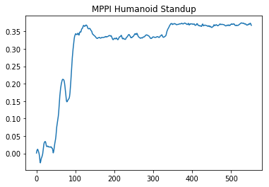
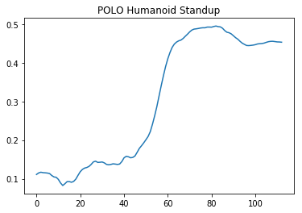

# Plan Online Learn Offline
This is an attempt to implement the algorithm proposed by 2019 ICLR paper Plan Online, Learn Offline: Efficient Learning and Exploration via Model-Based Control (<https://openreview.net/forum?id=Byey7n05FQ>).

## MPPI Control

### Humanoid standup task
Using purly MPPI trajectory optimization on `HumanoidStandup-v2` task, humanoid can successfully sit on the ground from the supine position.

To run MPPI on `HumanoidStandup` task: 
```
python MPPI_mujoco.py
```

Result:



#### MPPI Parameters:
- Planning horizon: 64
- Samples per step: 120
- Action space and range: 17 dimentions, in the range of [-1, 1]
- Noise: 0.2
- Lambda (MPPI temperature): 1.25
- Gamma (discount): 0.99
- Reward: 

    
    
    Where `Root_z` is the first dimension of state.

## POLO Implementation
The POLO algorithm incorporate an ensemble of value networks into the planning in MPPI. According to the paper, POLO would enable the humanoid to properly standup from supine position. However, in the attempt to reproduce the result although we can see a significant improvement above the MPPI framework at 100 timestamp (with MPPI achieve a reward to 0.2 and POLO achieving near 0.5), I was not able to get the humanoid standup from the sitting position.

To run POLO on `HumanoidStandup` task:
```
python POLO_mujoco.py
```

Result:



#### POLO Parameters
- Learning happens every 16 timestamps
- In each learning iteration, for 64 times, we select 32 states from the replay buffer to update the network
- Network specifications
    - Network input: observable attributes from states (first 22 parameters)
    - 2 layers, each with 16 hidden parameters
    - 6 networks
    - ADAM for optimizer, tanh for activation

#### Potential Problems Preventing Improvements
- Learning takes a long time. Each time the agent learns, it sample 32 states from 64 times, and gathers 120 sample trajectories with 64 planning horizon for each one. To get 100 timestamps as illustrated in the graph above, I ran the algorithm for 10 hours on my personal PC.
- State used is not the same as the paper specifies. According to `Appendix A` of the paper, it uses 34 designed dimentions for observation, and the mujoco humanoid environments gives 376-dimentional observation without a detailed documentation. Not able to find a perfect match between mujoco observations and what the paper specifies, I used the first 22 states per documented in (https://github.com/openai/gym/wiki/Humanoid-V1)
- Network update: 
    - Didn't use regulization for network
    - Didn't fully understand equation (5) for update the network, and instead used MSE loss for implementation.